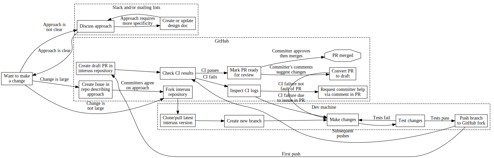

# Contributing to InterUSS repositories

Welcome to InterUSS and thank you for your interest in contributing to its repositories.  This page describes the general contribution process to InterUSS repositories, and each repository may have additional guidance specific to that repository.

In order to maximize the quality of contributions while keeping the time and energy spent by contributors and committers to a minimum, we kindly ask you to adhere to the practices described below.

## Contributing procedure

The procedure that most development should follow is outlined above, and the steps are described in more detail below.

### Want to make a change

We are excited you are interested in contributing!  Good changes are small, targeted, and concrete; see [General principles](#general-principles) below when deciding on the change you want to make.

### Discuss approach

If the overall approach to make the change is unclear (especially how to split up a [large contribution](#large-contributions)), discussing the goal with existing contributors can help most optimally match your specific knowledge of the problem or goal with existing contributors' knowledge of current state, history, and architecture of the project.  For rapid and/or small discussions, [Slack](README.md#slack) is a good forum.  For longer or more involved discussions in which future users or developers may be interested, the [mailing lists](README.md#mailing-lists) may be a more durable and long-form forum.  If your change is small and/or you already have a clear idea of how you think it can be implemented, this step can be skipped.

When soliciting feedback for an approach in one of these forums, be sure to provide:

* Your background (What tools are you using in what context that lead you to want to make this change?)
* Your goal for this change (What do you want to accomplish after the change that can't be accomplished now?

### Create or update design doc

For complicated changes, changes that have broad impact, and other changes whose impact is difficult to fully capture in a discussion thread, a design document dedicated to explaining the change may be valuable to create and share.  Existing InterUSS contributors may request the creation of this document during the [discussion](#discuss-approach).  Google Docs with wide sharing permissions are useful publishing means, or a wiki page on the appropriate repository may also be a good place to develop and publish the design document.  A good design document should generally include all of the following which are applicable to the change:

* Background for the change (What activities would users be performing that would be improved by the change?)
* What the change will accomplish (How will users' workflows be altered by the change?)
* How the change will accomplish its goal (How will the change integrate and interact with the existing components?)
* How the change will be developed (e.g., can the larger change be built in multiple small, self-contained changes, or will smaller changes need to be developed on a separate branch to be merged into the main branch at the end?  Small, self-contained changes are strongly preferred)
* What other impacts the change will have (What will users or other developers need to do differently after the change?)
* Other alternatives considered (if any)

Useful means to communicate the above may include:

* A narrative
* Overall architecture description
* Sequence diagrams
* Test plans

### Create Issue in repo describing approach

If the change is likely to span more than 1-2 PRs and/or the goal of an earlier PR is not self-evident without knowledge of anticipated future PRs, an Issue should be created in the appropriate repository to track the overall change and each PR should mention that issue.  If the approach was not previously discussed, the Issue may provide an opportunity for any lightweight discussion that may be useful.  An Issue can be created on the "Issues" page of the repository (one of the main tabs next to "Code").

### Fork interuss repository

InterUSS follows a [fork-and-pull-request workflow](https://docs.github.com/en/get-started/quickstart/contributing-to-projects).  The first step in this workflow is for the contributor (you) to create a "fork" of the repository in which the change will be made -- this is your own copy of the repository, stored on GitHub under your username.

During development, you will push (publish) your changes to your fork, and then request that InterUSS pull those changes from your fork to the canonical `interuss` GitHub repository.

### Clone/pull latest interuss version

Most changes are developed on a contributor's local workstation.  To prepare to make changes to a repository, the contributor must first clone the repository that will be changed.  In the fork-and-pull-request workflow, a contributor makes changes to their own fork of the `interuss` GitHub repository, so they should generally clone their fork rather than the canonical `interuss` GitHub repository.

If the contributor's fork was just created, it will already reflect the current content of the `interuss` repository.  Otherwise, with an existing local copy of the repository or an old fork, there may have been changes to the "upstream" `interuss` repository in the meantime.  Since all changes will eventually need to be applied to the latest version of the `interuss` repository, contributors should always start developing changes starting from the latest available version of the `interuss` repository.  With an existing local copy of the repository, upstream (`interuss` repository) remote changes must pulled into the local copy before branching to begin development; see, for instance, ["How do I update or sync a forked repository on GitHub"](https://stackoverflow.com/questions/7244321/how-do-i-update-or-sync-a-forked-repository-on-github).

If "repository", "fork", "branch", "upstream", "remote", "fetch" or "pull" are confusing, an introduction to git and GitHub is recommended; many are available on YouTube.

### Create new branch

Contributor changes will be made on a "branch" (a sequence of commits, hopefully starting from the latest commit in the canonical repository).  Branch names should generally refer to the change being made, but InterUSS does not have any concrete rules.

The branch will be created on the contributor's local workstation and stay there until ["Push branch to GitHub fork"](#push-branch-to-github-fork).

### Make changes

Contributors develop their change locally via whatever process they prefer.  A single commit is fine, or many commits is also fine.  Do not worry about linear commit history as InterUSS practice is to "squash" each PR into a single commit on the main branch when merged.

If other PRs are merged into the main branch of the canonical repository, a contributor will often (but not always) need to synchronize their branch with the canonical main branch to make sure their change still works with all of the latest canonical changes.  "Rebasing" maintains a linear commit history, but also rewrites history.  If you have successfully tested your change to work, "merging" `interuss`'s main branch into your working branch is recommended over rebasing so that you can always go back to the tested-working state.  If multiple updates are made to the canonical main branch, this synchronization (merging upstream main branch into working branch) may be performed multiple times during development.

### Test changes

Most InterUSS repositories have automated tests that must pass before changes may be merged into the canonical main branch.  These tests can usually be run on the contributor's local workstation; see the specific repository's CONTRIBUTING.md for more information.  It is often faster to fix broken tests by re-running them locally rather than relying on GitHub continuous integration, but ensuring all automated tests pass is not a requirement before creating a pull request (PR).

### Push branch to GitHub fork

Once a contributor believes their changes are fully ready to be merged into the canonical main branch, they push [their working branch](#create-new-branch) to [their GitHub fork](#fork-interuss-repository) -- this makes the changes publicly-accessible (via GitHub).

When a PR already exists and the contributor has made updates, pushing the new commits to the working branch on the contributor's fork which is associated with the PR should be sufficient to initiate a new round of CI tests, and the PR will be immediately updated with the new commits.

### Create draft PR in `interuss` repository

If the contributor has not yet created a pull request (contributor is requesting that InterUSS pull the changes from contributor's branch of contributor's fork into the main branch of InterUSS's canonical repository), create one now.  To create a pull request, navigate to the `interuss` repository on GitHub and click on "Pull requests".  If the contributor is logged in and recently pushed to a branch on their fork, a yellow box will appear indicating that these recent changes were made; use the link in that box to create the pull request.  Otherwise, click on "New pull request", then click on "compare across forks", and choose the working branch of the contributor's fork to pull into the main branch of the canonical `interuss` repository.  In either case, click "Create pull request".

#### PR title

Make sure to choose a clear, concise title indicating what the changes are accomplishing.  Titles should be in present imperative tense (e.g., "Add foo to bar", not "Added foo to bar" nor "Adding foo to bar") and should usually fit in the text box without scrolling.  Adding a bracketed prefix indicating which part of the repo is being changed can often be useful (e.g., `[uss_qualifier/scenarios] Add new Foo scenario`).

#### PR description

Unless the PR is absolutely clear, short, simple, and self-documenting given the title, a description should usually be provided.  If any [discussion](#discuss-approach) preceded this PR it should be mentioned and linked in the PR description.  If an [Issue](#create-issue-in-repo-describing-approach) covers this change, it should be mentioned and linked in the PR description.  Generally, the description should provide enough background and overview to reviewers to easily understand the purpose (and therefore judge the correctness) of the changes in the PR.

#### Draft pull request

If the green button at the bottom of the PR creation page indicates "Create pull request", click on the drop-down arrow next to it and instead select "Create draft pull request".  Once the button indicates "Draft pull request" and all steps above are complete, click that button to create the draft pull request.

### Check CI results

Most InterUSS repositories have automated tests that must pass before any changes are merged to the main branch of the repository -- these tests are "continuous integration" checks.  The programmatic definition of these tests may be found in the `.github/workflows` folder of the specific repository, and they should usually be described in the documentation of the specific repository.  When a new PR is created, or whenever new commits are pushed to the fork's branch on which the PR is based, these CI checks will begin automatically and their status will be indicated at the bottom of the PR page.  When the bottom of the PR indicates "All checks have passed", the PR is ready to be reviewed.

#### Contributor license agreement

All InterUSS repositories require a signed contributor license agreement (CLA) for all authors contributing to a PR before that PR can be merged into the canonical InterUSS main branch.  If a contributor does not yet have a signed CLA, this check will fail and should provide a link to the Linux Foundation's EasyCLA tool where a CLA can be signed.  A contributor may sign an individual CLA, or an organization may sign a CLA on behalf of many contributors.  Once signed, this check should pass for that contributor for all subsequent PRs without any additional action.  If a contributor has any trouble signing a CLA, they should quickly raise the issue on [Slack](README.md#slack) and InterUSS contributors can help resolve the situation.

#### Troubleshooting a failed CI check

In this case, first attempt to [inspect the CI logs](#inspect-ci-logs).  If a contributor cannot find this information, the next troubleshooting measure should be to [run the CI tests on the contributor's local workstation](#test-changes) if that had not already been done on the most recent commit -- running the CI tests locally often provides better visibility into errors than sifting through the GitHub CI logs.  If the CI tests passed on the contributor's local workstation but failed on GitHub, this is likely a problem with the CI tests themselves; in this case, [request committer help via comment in PR](#request-committer-help-via-comment-in-pr) indicating this situation and consider the PR ready for review.

### Inspect CI logs

If a CI check fails, a red X will be displayed next to the check.  Click on the "Details" link to the right of the check to see the logs leading up to the failure -- the last non-cleanup log messages should contain the information describing the reason the check failed.

### Request committer help via comment in PR

If a contributor fails to [resolve a failing CI check](#troubleshooting-a-failed-ci-check) or is otherwise blocked from making their PR pass all CI checks, the contributor should add a comment to the PR explaining the situation (expected results versus observed, what has been tried, etc) and then [mark the PR as ready for review](#mark-pr-ready-for-review).

### Mark PR ready for review

Once a contributor [verifies that the continuous integration tests for their PR have passed](#check-ci-results) or otherwise considers the PR ready for review, the contributor should mark the PR as ready for review using the link at the end of the PR page.  This will prompt an InterUSS [Committer](CONTRIBUTING.md#committers) to [review the pull request](review_guidelines.md).

InterUSS reviewers will generally not begin review of draft PRs until they are marked ready for review.

PRs may generally be left in the draft state while active development on them is proceeding, but if a contributor abandons a PR or will not work on it for 1-2 weeks or more, the contributor should close the PR.  Closed PRs can be re-opened by the contributor at a later time.  If active development on a PR appears to have stopped, an InterUSS contributor may close the PR for the contributor with a note that it can be re-opened in the future if the contributor desires.

### Convert PR to draft

Whenever the contributor becomes aware that the PR requires additional work before it is ready to be reviewed then merged to the main branch of the canonical `interuss` repository, the contributor should convert it to a draft PR.  On the PR page in GitHub, this can be accomplished by clicking on the "Convert to draft" link under the Reviewers section to the right of the PR description.

A contributor may become aware of this additional necessary work from:

* Reviewer comments, suggestions, or requested changes
* Contributor noticing or learning something new after initially marking PR ready for review
* GitHub indication that a conflicting PR has been merged and therefore the branch for this PR needs to be updated

### PR merged

Once an [InterUSS committer](CONTRIBUTING.md#committers) approves the PR, they or another committer should generally merge the PR to the main/master branch of the `interuss` repository unless otherwise noted.  Merging is sometimes delayed by needing to merge other PRs in sequence, or because of reduced committer availability; contributors may comment on PRs to raise any concerns.  Once the PR is merged, the contributor may delete their working branch on both their local copy of the repository and on their fork, if desired.

## General principles

1. Changes to resources in InterUSS repositories should usually be handled through a [Pull Request (PR)](https://docs.github.com/en/get-started/quickstart/contributing-to-projects).  Main/master branch changes must always be handled through a pull request.

1. No PR on the main branch can be merged without being reviewed.

1. The main/master branch should remain stable at all times. Before a PR is merged into the main branch, it must pass the continuous integration automated tests for the specific repository.  Checks are run automatically on every PR.

1. Before your PR can be accepted, you must submit a Contributor License Agreement (CLA). See [here](https://github.com/interuss/tsc/blob/main/CONTRIBUTING.md#contributor-license-agreement-cla) for more details.

1. Contributions should generally follow the [InterUSS general style guide](general_style_guide.md) and the [InterUSS Python style guide](python_style_guide.md) for Python code.

1. The size/complexity of individual PRs is a key factor with respect to the quality and efficiency of the reviews. When [Large Contributions](#large-contributions) are required, they should be structured as a series of small and focused PRs. Here are some helpful references:
    - [Small CLs (Google)](https://google.github.io/eng-practices/review/developer/small-cls.html)
    - [Strategies For Small, Focused Pull Requests, Steve Hicks](https://artsy.github.io/blog/2021/03/09/strategies-for-small-focused-pull-requests/)
    - [The Art of Small Pull Requests, David Wilson](https://essenceofcode.com/2019/10/29/the-art-of-small-pull-requests/)

### Large contributions

Given the critical nature of the content of most InterUSS repositories, contributions require careful review.  Large contributions often require substantial resources to review (much more than the sum of small PRs leading to the same result), so a [general principle](#general-principles) is that PRs should be small and focused.

A "large contribution" cannot have an easy, unambiguous definition as "large" depends on the complexity of the contribution (which relates to difficulty of review).  A very dense and complex contribution with many downstream effects may be "large" with only tens of lines of changes, whereas a conceptually-simple refactoring change that has hundreds or even thousands of lines of changes may not be large.  However, an anchor is that PRs gathering more than 10 initial comments from committers or 30 total comments from committers may be considered "large".

Sometimes, however, large changes cannot be reasonably avoided.  In this case, to ensure that large contributions don't have a negative impact on the quality of the reviews, the following steps help ensure your contribution gets merged progressively, maximizing knowledge sharing between contributors and committers.

#### Initial discussion

Get in touch with an [InterUSS committer](https://github.com/interuss/tsc/blob/main/CONTRIBUTING.md#committers) using the [mailing list](https://github.com/interuss/tsc#mailing-list) or [Slack](https://github.com/interuss/tsc#slack) so they know what to expect and can provide early feedback and guidance.  See ["Discuss approach"](#discuss-approach) also/instead.

#### Design document

When a [design document](#create-or-update-design-doc) is warranted based on the [approach discussion](#discuss-approach), it is often valuable to commit this material to the affected repository in an appropriately-placed DESIGN.md file or similar.

#### Work and PRs breakdown

An [InterUSS committer](https://github.com/interuss/tsc/blob/main/CONTRIBUTING.md#committers) may require large contributions to be broken down into smaller packages, allowing small PRs to be reviewed progressively. See this page for an actual [example](https://github.com/interuss/dss/wiki/Updating-SCD-API).
